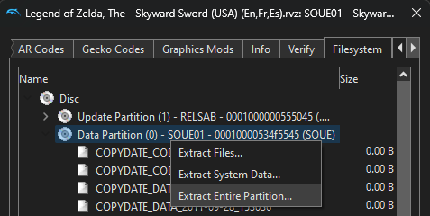

The Legend of Zelda: Skyward Sword  
[![Build Status]][actions] ![Progress] ![DOL Progress] ![RELs Progress] [![Discord Badge]][discord]
=============

[Build Status]: https://github.com/zeldaret/ss/actions/workflows/build.yml/badge.svg
[actions]: https://github.com/zeldaret/ss/actions/workflows/build.yml
[Progress]: https://decomp.dev/zeldaret/ss.svg?mode=shield&measure=code&label=Code
[DOL Progress]: https://decomp.dev/zeldaret/ss.svg?mode=shield&measure=code&category=dol&label=DOL
[RELs Progress]: https://decomp.dev/zeldaret/ss.svg?mode=shield&measure=code&category=modules&label=RELs
[Discord Badge]: https://img.shields.io/discord/688807550715560050?color=%237289DA&logo=discord&logoColor=%23FFFFFF
[discord]: https://discord.zelda.deco.mp

This repository contains a work-in-progress decompilation of *The Legend of Zelda: Skyward Sword*
for the Nintendo Wii system.

This repository does **NOT** contain any game assets or assembly. An existing copy of the game is
required in order to contribute.

Currently, the only supported version of the game is `SOUE01`: the NTSC-U 1.0 version (USA).

## 🔗 Dependencies

If the following steps don't work for you, please refer to the
[dtk dependencies documentation](https://github.com/encounter/dtk-template/blob/main/docs/dependencies.md).

### Windows

On Windows, it's **highly recommended** to use native tooling. WSL or msys2 are **not** required.
When running under WSL, [objdiff](https://github.com/encounter/objdiff) is unable to get filesystem
notifications for automatic rebuilds.

- Install [Python](https://www.python.org/downloads/) and add it to `%PATH%`.
- Download [ninja](https://github.com/ninja-build/ninja/releases) and add it to `%PATH%`.
  - Quick install via pip: `pip install ninja`

### macOS

- Install [ninja](https://github.com/ninja-build/ninja/wiki/Pre-built-Ninja-packages):

  ```sh
  brew install ninja
  ```

[wibo](https://github.com/decompals/wibo), a minimal 32-bit Windows binary wrapper, will be automatically downloaded and used.

### Linux

- Install [ninja](https://github.com/ninja-build/ninja/wiki/Pre-built-Ninja-packages).

[wibo](https://github.com/decompals/wibo), a minimal 32-bit Windows binary wrapper, will be automatically downloaded and used.

## 🔧 Building

- Clone the repository:
  ```
  git clone https://github.com/zeldaret/ss.git
  ```
- Using [Dolphin Emulator](https://dolphin-emu.org/), extract your `SOUE01` game ISO to `orig/SOUE01`.
  - Right-click The Legend of Zelda: Skyward Sword game in Dolphin and select `Properties` to open
    a new window containing various game properties

  - Select the `Filesystem` tab at the top of this new window (it should be the rightmost tab)
  - Right-click the entry labelled `Data Partition` and select `Extract Entire Partition...`

  - Extract the partition to `orig/SOUE01`
  - To save space, the only necessary files are the following. Any others can be deleted:
    - `sys/main.dol`
    - `files/rels.arc`
- Run the configure script:
  ```
  python configure.py
  ```
- Build the project with ninja:
  ```
  ninja
  ```

## 🔬 Diffing

Once the initial build succeeds, an `objdiff.json` should exist in the root of this project.

Download the latest release of the object diffing tool, `objdiff`, from
[encounter/objdiff](https://github.com/encounter/objdiff).

Once `objdiff` is opened, set the `Project directory` by clicking on the `Settings` button near the
`Project` heading.


The project settings window should have opened. At the top of this window, click the `Select`
button next to the `Project directory` heading.


Select the root of this project and `objdiff` should now be fully setup. The configuration should be loaded automatically.

Select an object from the left sidebar to begin diffing. Changes to the project will rebuild automatically: changes to source files, headers, `configure.py`, `splits.txt` or `symbols.txt`.


