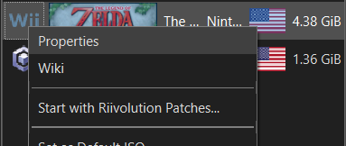
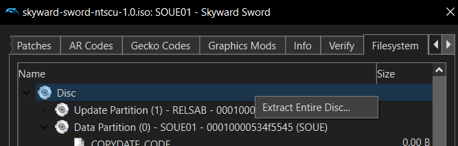
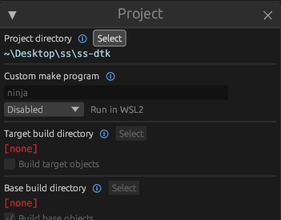
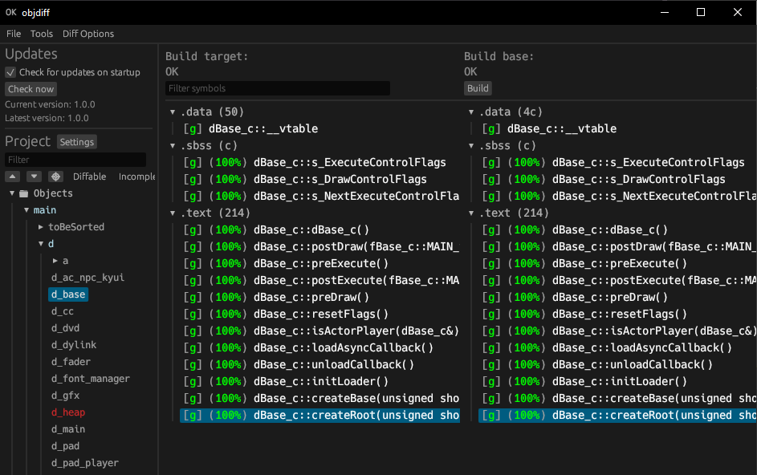

# The Legend of Zelda: Skyward Sword

This repository contains a work-in-progress decompilation of *The Legend of Zelda: Skyward Sword*
for the Nintendo Wii system.

This repository does **NOT** contain any game assets or assembly. An existing copy of the game is
required in order to contribute.

Currently, the only supported version of the game is `SOUE01`: the NTSC-U 1.0 version (USA).

## 🔗 Dependencies

If the following steps don't work for you, please refer to the
[dtk dependencies documentation](https://github.com/encounter/dtk-template/blob/main/docs/dependencies.md).

### Windows

On Windows, it's **highly recommended** to use native tooling. WSL or msys2 are **not** required.
When running under WSL, [objdiff](https://github.com/encounter/objdiff) is unable to get filesystem
notifications for automatic rebuilds.

- Install [Python](https://www.python.org/downloads/) and add it to `%PATH%`.
- Download [ninja](https://github.com/ninja-build/ninja/releases) and add it to `%PATH%`.
  - Quick install via pip: `pip install ninja`

### macOS

- Install [ninja](https://github.com/ninja-build/ninja/wiki/Pre-built-Ninja-packages):

  ```sh
  brew install ninja
  ```

- Install [wine-crossover](https://github.com/Gcenx/homebrew-wine):

  ```sh
  brew install --cask --no-quarantine gcenx/wine/wine-crossover
  ```

After OS upgrades, if macOS complains about `Wine Crossover.app` being unverified, you can
unquarantine it using:

  ```sh
  sudo xattr -rd com.apple.quarantine '/Applications/Wine Crossover.app'
  ```

### Linux

- Install [ninja](https://github.com/ninja-build/ninja/wiki/Pre-built-Ninja-packages).
- For non-x86(_64) platforms: Install wine from your package manager.
  - For x86(_64), [wibo](https://github.com/decompals/wibo), a minimal 32-bit Windows binary
    wrapper, will be automatically downloaded and used.

## 🔧 Building

- Clone the repository:
  ```
  git clone https://github.com/lepelog/ss-dtk.git
  ```
- Using [Dolphin Emulator](https://dolphin-emu.org/), extract your `SOUE01` game ISO
  - Right-click The Legend of Zelda: Skyward Sword game in Dolphin and select `Properties` to open
    a new window containing various game properties

  - Select the `Filesystem` tab at the top of this new window (it should be the rightmost tab)
  - Right-click the topmost entry labelled `Disc` and select `Extract Entire Disk`

  - Once this has completed, copy the following files into the the `orig/SOUE01` folder of this
    project. The rest can be deleted to save space.
    - `DATA/sys/main.dol`
    - `DATA/files/rels.arc`
- Run the configure script:
  ```
  python configure.py
  ```
- Build the project with ninja:
  ```
  ninja
  ```

## 🔬 Diffing

Once the initial build succeeds, an `objdiff.json` should exist in the root of this project.

Download the latest release of the object diffing tool, `objdiff`, from
[encounter/objdiff](https://github.com/encounter/objdiff).

Once `objdiff` is opened, set the `Project directory` by clicking on the `Settings` button near the
`Project` heading.


The project settings window should have opened. At the top of this window, click the `Select`
button next to the `Project directory` heading.



Select the root of this project and `objdiff` should now be fully setup. The configuration should be loaded automatically.

Select an object from the left sidebar to begin diffing. Changes to the project will rebuild automatically: changes to source files, headers, `configure.py`, `splits.txt` or `symbols.txt`.


